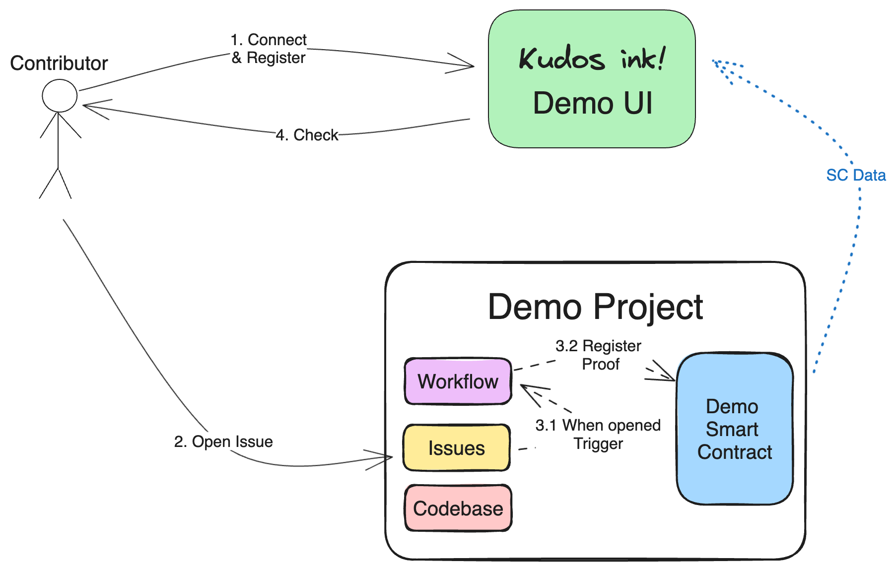

# POC E2E Demo

## About

This demonstration showcases Kudos Ink! Proof of Concept (POC), developed during the ["Polkadot Ink! Hackathon"](https://www.blog.encode.club/polkadot-ink-hackathon-powered-by-encode-club-prizewinners-and-summary-0ee9efac42ea) powered by the Encode Club. We proposed an automated contribution reward services using custom smart contracts and Github Workflows. For more details on how it works, here is the [finale winning pitch](https://www.youtube.com/watch?v=zw07lCW639w).

## Use this demo

In this demo, a contribution refers to "opening an issue in this repository". A proof of contribution will be registered in the demo contract.
Below is the detailed workflow:

#### Steps:

1. Connect and register your identity (e.g. Github handle) in the Demo UI app.

   This action marks your intention to contribute to a project. In this case, to test the demo.

2. Complete the expected work. For this demo, you are required to **open an issue in this repository**.

3. Once the issue is opened, a proof of contribution will be automatically registered into the demo smart contract. You will be notified in an issue comment with a link to the proof.

4. Finally, check your contribution status, marked as complete, in the Demo UI app.

## Stack: ink!athon Boilerplate

This project uses the [ink!athon Boilerplate](https://github.com/scio-labs/inkathon) full-stack dApp boilerplate for ink! smart contracts with an integrated frontend.